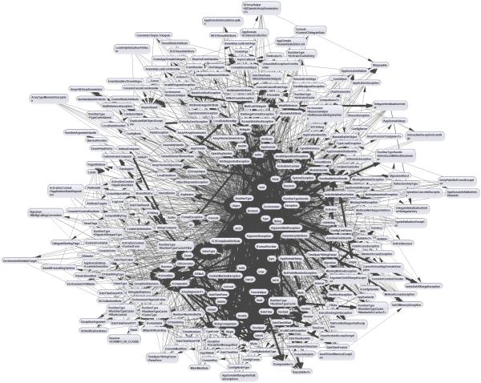
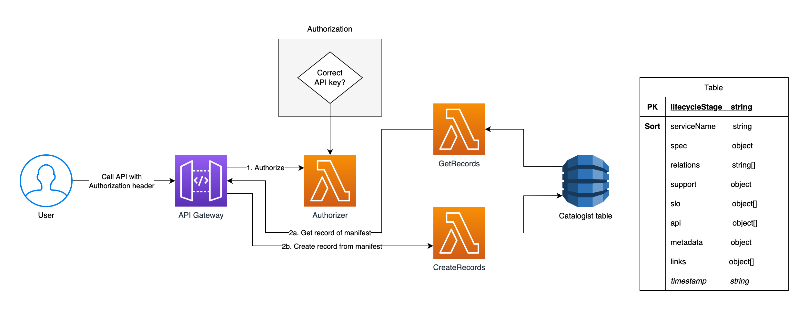

# `catalogist` 📚 📓 📒 📖 🔖

 [](https://app.fossa.com/projects/git%2Bgithub.com%2Fmikaelvesavuori%2Fcatalogist?ref=badge_shield) [](https://sonarcloud.io/summary/new_code?id=mikaelvesavuori_catalogist) [](https://codescene.io/projects/22501) [](https://codescene.io/projects/22501) [](https://codecov.io/gh/mikaelvesavuori/catalogist) [](https://codeclimate.com/github/mikaelvesavuori/catalogist/maintainability)

## The easy way to catalog and make your software and (micro)services visible to your organization through an API

**You were a person on a mission: To have a total bird's eye view on your entire software estate. You tried to win the hearts and minds of developers with microservices, and after many battles you are now finally churning out itty-bitty services, but find yourself in a quagmire without the faintest clue about what's going on anymore. Like [Fox Mulder](https://en.wikipedia.org/wiki/Fox_Mulder), you become disillusioned with what sad excuse of a "truth" is _actually_ out there.** 😭😭😭



_From [Mario Fusco's Twitter post](https://twitter.com/mariofusco/status/1112332826861547520/photo/1)_

`catalogist` helps you make sense of that, in a lightweight and developer-friendly way, without having to break the bank to purchase six-figure enterprise architecture software or going all-in on [Backstage](https://backstage.io).

### How it works

Simple: Write a bit of metadata description (a _manifest_ file) for every service/software in a standardized format and send it to a central service, making it available to read through an API. With no more that that, we can mitigate the lack of visibility and nomenclature around how we express the attributes of our software or services.

When the manifest reaches the actual database/persistence layer, it is called a _record_ while it's there, laying dormant.

An implementer will interact with `catalogist` in one of two typical ways:

- **Custom software (e.g. your own microservices)**: Create a _manifest_ file in the root of the application, and make a POST request to the `catalogist` service during the CI stage. This is ideal since it enforces an always-up-to-date version of the solution's manifest.
- **Manually, for example for non-custom (e.g. commercial-off-the-shelf") software**: The `catalogist` service can be called manually or as an integrated part of a "dashboard" that you build yourself. An operations team could also do infrequent updates based on a ticketing system.

### Diagram

_As it stands currently, `catalogist` is implemented in an AWS-slanted direction. This should be fairly easy to modify so it works with other cloud platforms and with other persistence technologies. If there is sufficient demand, I might add extended support. Or you do it! Just make a PR and I'll see how we can proceed._

On the surface `catalogist` is a relatively simple Node.js-based serverless application that exposes an API Gateway with three microservices behind it: an optional authorizer, one for creating a record, and the last one for getting records. Records are persisted in DynamoDB. When deployed, the standard implementation—as provided—results in a complete solution with an (optional) authorizer function, the backend functions, and all required infrastructure resources.



Please see the [API docs on Bump](https://bump.sh/doc/catalogist) or the [generated documentation site](https://catalogist.pages.dev) for more detailed information.

---

## Prerequisites

- Amazon Web Services (AWS) account with sufficient permissions so that you can deploy infrastructure. A naive but simple policy would be full rights for CloudWatch, Lambda, API Gateway, DynamoDB, X-Ray, and S3.

## Installation

Clone or fork the repo as you normally would. Run `npm install`.

## Commands

The below commands are the most critical ones. See package.json for more commands!

- `npm start`: Runs Serverless Framework in offline mode
- `npm test`: Tests code
- `npm run deploy`: Deploys code with Serverless Framework
- `npm run build`: Package and build the code with Serverless Framework

## Configuration

1. You will need to configure your own AWS account number in `serverless.yml`.
2. If you want to use the authorizer function, you should enter a self-defined API key in `src/controllers/authorizer.ts`. If you don't want to use the authorizer, disable it for the other controllers (commenting out or removing lines) in `serverless.yml`.

## Running `catalogist`

Run `npm start`.

## Deployment

Run `npm run deploy`.

## Setting up for CI and automation

In your CI tool, just call the API, passing in your manifest file and your (self-defined) API key:

```bash
curl -X POST ${ENDPOINT} -d "@manifest.json" -H "Authorization: ${API_KEY}"
```

No need for the authorization header (API key) if you opted out of the authorizer behavior.

## Manifest

The manifest file is a simple JSON file or a JSON payload that describes your solution, system, or service.

The below gives an overview of what data can be described. See the example and interface specification further down, or [the published OpenAPI schema on Bump](https://bump.sh/doc/catalogist), for more details.

### Required top-level keys/fields/properties

#### `spec`

Fundamental information about your solution. **Note that only the `serviceName` field is required, all other properties are optional.**

### Optional top-level keys/fields/properties

#### `relations`

Relations (named) that this solution may have to other relations.

#### `support`

Support information for your solution.

#### `slo`

Array of SLO items. An SLO item represents Service Level Objective (SLO) information. Max 10 items allowed.

#### `api`

Array of API items. An API item represents the name of any API connected to this solution. The value should ideally point to a (local or remote) schema or definition. Max 10 items allowed.

#### `metadata`

Any optional metadata. Accepts custom-defined keys with string values.

#### `links`

Array of Link items. A Link item represents a link to external resources. Max 10 items allowed.

### Full example

The below gives you an idea of how a "full-scale" manifest might look.

```json
{
  "spec": {
    "serviceType": "service",
    "lifecycleStage": "production",
    "version": "1.0.0",
    "description": "My service",
    "serviceName": "my-service",
    "team": "ThatAwesomeTeam",
    "responsible": "Someguy Someguyson",
    "system": "some-system",
    "domain": "some-domain",
    "tags": ["typescript", "backend"],
    "dataSensitivity": "Public"
  },
  "relations": ["my-other-service"],
  "support": {
    "resolverGroup": "ThatAwesomeTeam"
  },
  "slo": [
    {
      "description": "Max latency must be 350ms for the 90th percentile",
      "level": "99.9",
      "percentile": "p90",
      "maxLatency": 350
    }
  ],
  "api": [
    {
      "MyProjectApi": "./api/schema.yml"
    }
  ],
  "metadata": {
    "arkitOutputFolder": "./diagrams/",
    "sbomOutputFile": "./sbom-output.txt",
    "typedocOutputFolder": "./typedoc-docs/"
  },
  "links": [
    {
      "url": "https://my-confluence.atlassian.net/wiki/spaces/DEV/pages/123456789/",
      "title": "Confluence documentation",
      "icon": "documentation"
    },
    {
      "title": "Jira backlog",
      "url": "https://admin.example-org.com",
      "icon": "backlog"
    },
    {
      "title": "CloudWatch Dashboard",
      "url": "https://region.signin.aws.amazon.com",
      "icon": "dashboard"
    },
    {
      "title": "Disaster Recovery Plan",
      "url": "https://my-confluence.atlassian.net/wiki/spaces/DEV/pages/123456789/DisasterRecoveryPlan",
      "icon": "recovery"
    }
  ]
}
```

### Specification

This is how it's defined as a TypeScript interface:

```TypeScript
/**
 * @description The Manifest is the container of your solution information.
 */
export interface Manifest {
  spec: Spec;
  relations?: Relations;
  support?: Support;
  api?: Api;
  slo?: Slo;
  links?: Links;
  metadata?: Metadata;
  timestamp?: string | number; // Timestamp value is generated when the manifest is persisted
}

/**
 * @description Fundamental information about your solution.
 */
type Spec = {
  serviceName: string;
  serviceType?: ServiceType;
  lifecycleStage?: LifecycleStage;
  version?: string;
  description?: string;
  responsible?: string;
  team?: Team;
  system?: System;
  domain?: Domain;
  dataSensitivity?: DataSensitivity;
  tags?: string[];
};

/**
 * @description Describes which type of solution this is.
 */
type ServiceType = 'custom' | 'cots' | 'product' | 'external';

/**
 * @description Describes which stage of the lifecycle this solution is in. Defaults to "production".
 */
type LifecycleStage = string;

/**
 * @description The team that owns this solution.
 */
type Team = string;

/**
 * @description The system this solution is part of.
 */
type System = string;

/**
 * @description The domain this solution/system is part of.
 */
type Domain = string;

/**
 * @description The overall data sensitivity of your solution.
 */
type DataSensitivity = 'Public' | 'Internal' | 'Confidential';

/**
 * @description Relations (named) that this solution may have to other relations.
 */
type Relations = {
  [RelationName: string]: string;
};

/**
 * @description Support information for your solution.
 */
type Support = {
  [SupportData: string]: string;
};

/**
 * @description Array of SLO items. Max 10 items allowed.
 */
type Slo = SloItem[];

/**
 * @description Service level objective (SLO) information. Max 10 items allowed.
 */
type SloItem = {
  description: string;
  level?: string;
  percentile?: Percentile;
  maxLatency?: number;
};

/**
 * @description Percentile units.
 */
type Percentile = 'p50' | 'p75' | 'p90' | 'p95' | 'p99';

/**
 * @description Array of API items. Max 10 items allowed.
 */
type Api = ApiItem[];

/**
 * @description The name of any API connected to this solution. The value should ideally point to a (local or remote) schema or definition.
 */
type ApiItem = {
  [ApiName: string]: string;
};

/**
 * @description Any optional metadata. Accepts strings, numbers and objects as singles or as arrays.
 */
type Metadata = {
  [MetadataKey: string]: string;
};

/**
 * @description Array of Link items. Max 10 items allowed.
 */
type Links = LinkItem[];

/**
 * @description Link to external resources.
 */
type LinkItem = {
  title: string;
  url: string;
  icon: Icon;
};

/**
 * @description The type of icon that should represent this resource.
 */
type Icon = 'documentation' | 'backlog' | 'dashboard' | 'recovery';
```

## Validation and sanitization

There are several levels at which any input data is sanitized and validated.

1. **API Gateway validator**: AWS API Gateway is set up to only allow payloads that correspond to the JSON Schema-based validator. See `api/create.validator.json`.
2. **Code-level validation**: Input data is processed when `catalogist` attempts to form input data into a Manifest "value object". During that step we coerce the input into a new object (stringify, then parse as a new object), drop unknown keys, check the size of the remaining object, and also check for missing information. See `src/domain/valueObjects/Manifest.ts`.

Because there is a bit of customization allowed, `catalogist` will only drop unknown keys from the root object and from within the `spec`, `slo`, and `links` arrays.

### Rules and limits

- All POST request input is sanitized.
- The regex pattern that is most often used is `/[^a-z0-9@åäöøáéíóúñü\.\-_]/`; for values a few more characters (parentheses, brackets, spaces etc.) are allowed too.
- Custom key names (in the `support` and/or `metadata` fields) may be 50 characters long.
- Custom values (in the `support` and/or `metadata` fields) may be 500 characters long.
- The maximum ingoing payload size must be less than 10000 characters when stringified.
- You are allowed to use a maximum of 10 items in the `api`, `slo` and `links` arrays.
- You are allowed to use a maximum of 100 items in the `relations` array.

### API Gateway validator (using JSON schema)

You can toy around with [an online JSON schema validator](https://json-schema-validator.herokuapp.com) if you want to test and verify any changes you might want make to the validator.

### Making changes to validation and sanitization

Changes in validations need to happen in several places:

- `api/create.validator.json` is a JSON Schema that handles the API Gateway validation
- `src/domain/valueObjects/Manifest.ts` does the actual transformation and code-level sanitization/validation

It's also advisable to update the documentation and types:

- `api/schema.yml` represents the API schema, and therefore should be in sync with the above JSON Schema
- `src/domain/interfaces/Manifest.ts` is the type of the Manifest

---

## Example API calls

- [Create a record](#create-a-record)
- [Get records](#get-records)
- [Get records (by single service name)](#get-records-by-single-service-name)
- [Get records (by multiple service names)](#get-records-by-multiple-service-names)
- [Get records (by lifecycle stage)](#get-records-by-lifecycle-stage)
- [Get records (by lifecycle stage and single service name)](#get-records-by-lifecycle-stage-and-single-service-name)
- [Get records (by lifecycle stage and multiple service names)](#get-records-by-lifecycle-stage-and-multiple-service-names)

**Note that "GET" requests will always return an array, even if the result set is empty.**

### Create a record

This is the most minimal, valid example you can create a record with.

#### Example request

**POST** `{{BASE_URL}}/record`

```json
{
  "spec": {
    "serviceName": "my-service"
  }
}
```

#### Example response

`204 No Content`

### Get records

The basic "get records" call will get all records that have `spec.lifecycleStage` set to `production` (the fallback value).

#### Example request

**GET** `{{BASE_URL}}/records`

#### Example response

```json
[
  {
    "spec": {
      "serviceName": "my-service",
      "lifecycleStage": "production",
      "timestamp": 1641987006000
    }
  },
  {
    "spec": {
      "serviceName": "some-other-service",
      "lifecycleStage": "production",
      "timestamp": 1641987007000
    }
  },
  {
    "spec": {
      "serviceName": "user-service",
      "lifecycleStage": "production",
      "timestamp": 1641987008000
    }
  }
]
```

### Get records (by single service name)

If no `lifecycleStage` is provided, `production` will be inferred.

#### Example request

**GET** `{{BASE_URL}}/records?serviceName=my-service`

#### Example response

```json
[
  {
    "spec": {
      "serviceName": "my-service",
      "lifecycleStage": "production",
      "timestamp": 1641987006000
    }
  }
]
```

### Get records (by multiple service names)

Get multiple services in the `production` lifecycle stage.

#### Example request

**GET** `{{BASE_URL}}/records?serviceName=my-service,some-other-service`

#### Example response

```json
[
  {
    "spec": {
      "serviceName": "my-service",
      "lifecycleStage": "production",
      "timestamp": 1641987006000
    }
  },
  {
    "spec": {
      "serviceName": "some-other-service",
      "lifecycleStage": "production",
      "timestamp": 1641987007000
    }
  }
]
```

### Get records (by lifecycle stage)

Get all records by lifecycle stage.

#### Example request

**GET** `{{BASE_URL}}/records?lifecycleStage=testing`

#### Example response

```json
[
  {
    "spec": {
      "serviceName": "test-service",
      "lifecycleStage": "testing",
      "timestamp": 1641987004000
    }
  },
  {
    "spec": {
      "serviceName": "api-testing-service",
      "lifecycleStage": "testing",
      "timestamp": 1641987005000
    }
  }
]
```

### Get records (by lifecycle stage and single service name)

Use a combination of lifecycle stage and service name.

#### Example request

**GET** `{{BASE_URL}}/records?lifecycleStage=testing&serviceName=test-service`

#### Example response

```json
[
  {
    "spec": {
      "serviceName": "test-service",
      "lifecycleStage": "testing",
      "timestamp": 1641987004000
    }
  }
]
```

### Get records (by lifecycle stage and multiple service names)

Get multiple services by name and lifecycle stage.

#### Example request

**GET** `{{BASE_URL}}/records?lifecycleStage=production&serviceName=my-service,some-other-service`

#### Example response

```json
[
  {
    "spec": {
      "serviceName": "my-service",
      "lifecycleStage": "production",
      "timestamp": 1641987006000
    }
  },
  {
    "spec": {
      "serviceName": "some-other-service",
      "lifecycleStage": "production",
      "timestamp": 1641987007000
    }
  }
]
```
